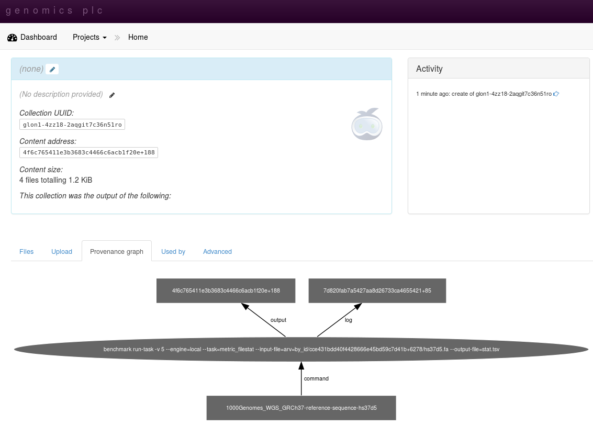
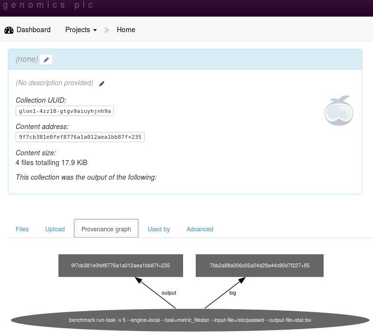
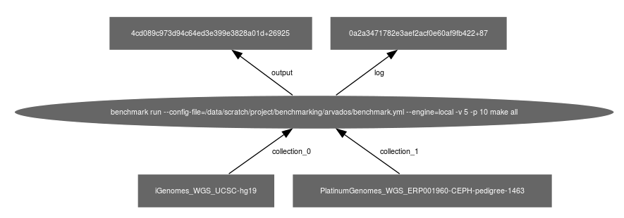

===================
Arvados integration
===================

This section describes the various ways that the benchmark system
can work with :term:`Arvados` :term:`Keep` and :term:`Crunch`.

.. note::

   This functionality is experimental.

.. note:: 

   The commands below assume that the arvados `CLI environment
   <http://doc.arvados.org/sdk/cli/install.html>`_ and `python SDK
   <http://doc.arvados.org/sdk/python/sdk-python.html>`_ have been
   installed and a `working environment
   <http://doc.arvados.org/user/getting_started/check-environment.html>`_
   has been set up. Also, you will need `git access
   <http://doc.arvados.org/user/tutorials/git-arvados-guide.html>`_

The benefit of the benchmark system is that commands that have been
added to the :ref:`TaskLibrary` can be executed on data from
:term:`Keep` or on the local file system and while at the same time
allowing execution on a local machine or on a cluster. The system
takes care of the mounting/unmounting of data and the job submission
and execution.

Running jobs locally
====================

To recap, this is how you execute a task with :doc:`tools/run-task`::

  benchmark run-task \
    --task=metric_filestat \
    --input-file=/etc/passwd \
    --output-file=test.out \

This will execute a metric task called ``filestat``. On a cluster,
it will submit the task to the cluster, see :ref:`clustersetup`
on how to set it up.

Running a task with data from Keep
----------------------------------

To run a single task using data in :term:`Keep`, prefix the
location in the library with the ``arv=`` prefix. The following
command will run the metric ``filestat`` on the file :file:`hs37d5.fa`
and output the results in :file:`test.out`::

  benchmark run-task \
    --task=metric_filestat \
    --input-file=arv=by_id/cce431bdd40f4428666e45bd59c7d41b+6278/hs37d5.fa \
    --output-file=test.out \

The same could be achieved by manually mounting `Arvados Keep` and
using the file system path in its mounted location::

  mkdir -p /tmp/keep
  arv-mount /tmp/keep
  benchmark run-task \
      --task=metric_filestat \
      --input-file=arv=by_id/cce431bdd40f4428666e45bd59c7d41b+6278/hs37d5.fa \
      --output-file=test.out \
  fusermount -u /tmp/keep
  
In fact, this is exactly what happens behind the scenes.  

:doc:`tools/run-task` is cluster enabled. If a cluster is detected,
the job will be submitted to the appropriate queue. See the command
line options to :doc:`tools/run-task` on how to control cluster
submission.

The command above does not upload the results back to arvados
keep. This happens in the next step.

Running a task as an arvados job
--------------------------------

Running a task through `arv-crunch-job
<http://doc.arvados.org/user/tutorials/tutorial-firstscript.html>`_
will upload the results to :term:`Keep` while at the same time
linking the output to the input and the command executed. This happens
when specifying the `arvados` engine option::

   benchmark run-task \
      --engine=arvados \
      --task=metric_filestat \
      --input-file=arv=by_id/cce431bdd40f4428666e45bd59c7d41b+6278/hs37d5.fa \
      --output-file=stat.tsv

This will create a job in the arvados system, but run it locally. As
before, if the presence of a cluster is detected, the job will be
submitted. The :term:`UUID` of the output and log files generated will
be echoed at the end of the script. Through the job, input and output
are linked.

.. note::

   Note that we are referring to the data set by UUID. This is
   necessary for arvados run-job to identify files within :term:`Keep`
   so that it can maintain the link between input and output.

The input files need not come from :term:`Keep`. This method can
also be used to upload data to :term:`Keep` that has been generated
from a local file::

   benchmark run-task \
      --engine=arvados \
      --task=metric_filestat \
      --input-file=/etc/passwd \
      --output-file=stat.tsv

The provenance graph will link the uploaded file to the command that
created it:

At the moment, the execution uses a locally installed `benchmark`. As
a consequence, the version of the code is not known to
:term:`Keep`. In the future it will be possible to specify a docker
image hosted within :term:`Keep`. This should then permit full
provenance tracking that includes the version of code and tools.

Running a workflow with files from Arvados Keep
-----------------------------------------------

It is possible to run workflows on the local system using the 
benchmark workflow system but using files within :term:`Keep`.
Files that reside within :term:`Keep` are identified by the
``arv=`` prefix. Save the following in a file called :file:`benchmark.yml`::

    title : >-
      Simple Variant-calling + QC workflow

    description: >-
      A simple workflow calling variants in a set of BAM files
      and running bcftools stats for QC.

    tags:
      - SNV calling

    setup:

      tools:
	- weCall

      metrics:
	- bcftools_stats

    database:
      url: sqlite:///./csvdb

    input:
      reference_fasta: arv=by_id/303fdf14a0443728c5b2e3e0ab25a155+251771/Sequence/WholeGenomeFasta/genome.fa

      bam: arv=by_id/17322baa637c0b5152c8eef24a6c2b52+2559856/*.bam

      regex: ([^/ ,]+).bam

    weCall:

      options: --numberOfJobs 8 --allowMNPCalls 0 --recalibrateBaseQs 1 --regions=chr1:30000000-31000000

    bcftools_stats:

      options: --fasta-ref arv=by_id/303fdf14a0443728c5b2e3e0ab25a155+251771/Sequence/WholeGenomeFasta/genome.fa --apply-filters
      "PASS,."

To run the workflow, type::

   benchmark run -v 5 -p 10 make all

This will execute the workflow on the local cluster using data sets
stored within :term:`Keep`.

Note that it is possible to mix both files located on the file system
and files residing in :term:`Keep`. As before, specifying 
``--engine=arvados`` will run the workflow as a crunch script and upload
the data to :term:`Keep`::

   benchmark run --engine=arvados -v 5 -p 10 make all

The dependencies between input and output are stored in :term:`Keep`:

To upload metrics to a database, use the target ``upload`` instead
of ``all``::

   benchmark run --engine=arvados -v 5 -p 10 make upload

.. note::

   When using an sqlite database, make sure to use an absolute path
   name as the crunch script will run the benchmark workflow within a
   temporary local directory.

The :term:`UUID` of user, job and output will be added to the database
into the table :term:`arvados_job`.

Often a workflow is run and updated iteratively and only the final
output should be uploaded to :term:`Keep`. To do this, it is possible
to do::

   benchmark run -v 5 -p 10 make all
   ...
   benchmark run --engine=arvados -v 5 -p 10 make keep

The first statemement will run the workflow locally. Once you think
all is ok, the second statement will upload the data into :term:`Keep`
without re-running any computations - unless there are files that are
out-of-date.

To upload to :term:`Keep` while simultaneously uploading the metric data
to the database, use::

   benchmark run -v 5 -p 10 make all
   ...
   benchmark run --engine=arvados -v 5 -p 10 make keep-and-load

This will make sure that the :term:`UUID` between :term:`Keep` and
the database are synchronized.

Running jobs through :term:`Crunch`
======================================

Not implemented yet as crunch not fully installed in London.
Should be straight-forward using the CLI interface to daisy.

Notes
=====

arv-crunch-job
---------------

Benchmark tasks can be run using Arvados' `run-command
<http://doc.arvados.org/user/topics/run-command.html>`_ utility.
Create the following script and call it :file:`run.job`::

    {
     "script": "run-command",
     "script_version": "master",
     "repository": "arvados",
     "script_parameters": {
       "command": [
	   "benchmark",
	   "run-task",
	   "-v 5",
	   "--task=metric_filestat",
	   "--input-file=arv=by_id/cce431bdd40f4428666e45bd59c7d41b+6278/hs37d5.fa",
	   "--output-file=stat.tsv"
       ]
     }
    }

Then run this script using the following command::

   arv-crunch-job --job="$(cat run.job)"

This happens under the hood when ``--engine=arvados`` is set in `benchmark run-task`.

.. todo::

   * Upload :file:`benchmark.yml` file when running a workflow.

   * Implement use of docker image for code and config files from
     benchmark library.

   * Link to collections in Keep within postgres.
       * add output_uuid, requires setting the field from 
	 CollectionWriter within run-command or querying
	 arvados system after crunch job has finished with
	 job_uuid.
       * add collection ids to input files?

   * Add meta data/description to new collection created by
     benchmark jobs: When it was run, by whom, take text from
     daisy.yml file?

   * Run workflows inside Arvados crunch.

.. glossary::

   uuid
      Unique identifier for an object in Keep

   Arvados
      The `Arvados Project`_ is dedicated to building a new generation
      of open source distributed computing software for
      bioinformatics, data science, and production analysis using
      massive data sets

   Keep
      `Arvados Keep`_ is the data storage of arvados.

   Crunch
      `Arvados Crunch`_ is the execution framework of arvados.

.. _Arvados Crunch: http://doc.arvados.org/user/tutorials/intro-crunch.html
.. _Arvados Keep: https://dev.arvados.org/projects/arvados/wiki/Keep
.. _Arvados: https://arvados.org/
