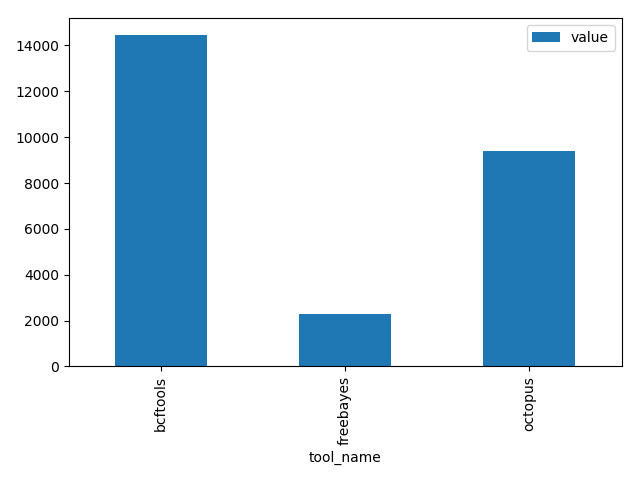

========================
Variant caller benchmark
========================

Daisy comes with :term:`task library` wrapping tools required for
variant calling and benchmarking variant calls. The following guide
shows how to install daisy and run a variant-caller benchmark on
publicly available data. It starts from scratch, though you will have
to have installed a conda_ environment.

Installation
============

We start by creating a conda environment and installing daisy::

    conda create -y -n daisy python=3.6 matplotlib cgatcore
    pip install cgat-daisy
    conda install ruamel_yaml pysam

.. note::

   We use a `pip install` until conda package is available.

Next, we install a few variant callers (freebayes_, octopus_ and
bcftools_) and variant metrics that we want to test::

    conda install -y -c bioconda freebayes octopus bcftools samtools bedtools

All of these have already been wrapped in daisy's :ref:`tasklibrary`
and are ready to be used. Next, we download the aligned exome
sequencing data of the NA12878. We will only use chromosome 20 to
avoid downloading the whole file (26Gb)::

    samtools view -h ftp://ftp-trace.ncbi.nih.gov/1000genomes/ftp/technical/working/20120117_ceu_trio_b37_decoy/CEUTrio.HiSeq.WEx.b37_decoy.NA12878.clean.dedup.recal.20120117.bam 20 | samtools view -bS > NA12878.bam
    samtools index NA12878.bam

For variant calling, we will also need the reference genome sequence::

    wget ftp://ftp.1000genomes.ebi.ac.uk/vol1/ftp/technical/reference/phase2_reference_assembly_sequence/hs37d5.fa.gz
    gunzip hs37d5.fa

Running the benchmarks
======================

Create a benchmark.yml file::

    title : >-
      Benchmarking variant callers on NA12878 exome data

    description: >-
      This benchmark calls short variants on NA12878 exome data
      evaluates the results by comparison against a truth data set
      (Genomes in a Bottle, NA12878).

    tags:
      - SNV calling
      - NA12878

    database:
      # we will uload results to a local sqlite database
      url: sqlite:///./csvdb

    setup:
      suffix: vcf.gz

      tools:
	- bcftools
	- freebayes
	- octopus

      metrics:
	- bcftools_stats

    input:
      reference_fasta: hs37d5.fa

      bam:
	- NA12878.bam

    bcftools:
      options: --format-fields GQ,GP --multiallelic-caller

    bcftools_stats:
      options: --fasta-ref hs37d5.fa --apply-filters "PASS,."
      # apply a hard filter to freebayes output
      task_specific:
	freebayes.*:
	  filter_exclude: "FORMAT/GT == '.' || INFO/DP < 5 || QUAL < 20"

Now run the benchmark::

   daisy run -v 5 make all

You can now upload the results to the database::

   daisy run -v 5 make upload

This will organize the metric data into an sqlite database. To get the
number of variants called, you can query the database::

   sqlite3 -header -csv csvdb "select i.tool_name, m.key, m.value
   	   FROM bcftools_stats_summary_numbers AS m, instance AS i
	   WHERE i.id = m.instance_id AND key='number_of_SNPs' "

which will produce the following output:

.. csv-table::
   :header: tool_name,key,value
  
   bcftools,number_of_SNPs,14454
   freebayes,number_of_SNPs,2308
   octopus,number_of_SNPs,9386

Note that such tables can be easily obtained within pandas and used
for plotting. For example, the following small python snippet::

    import pandas
    import sqlalchemy
    import matplotlib.pyplot as plt

    database = sqlalchemy.create_engine("sqlite:///./csvdb")
    df = pandas.read_sql(
	"SELECT i.tool_name, m.key, m.value "
	"FROM bcftools_stats_summary_numbers AS m, instance AS i "
	"WHERE i.id = m.instance_id AND key='number_of_SNPs' ", database).set_index("tool_name")

    df.plot.bar()
    plt.tight_layout()
    plt.savefig("number_variants.png")

will create the following figure:

Adding another metric
=====================

For a proper variant caller comparison, we should compare against a
gold standard of variant calls for our data set. This is available from the
NIST/Genome in a bottle initiative::

   wget ftp://ftp-trace.ncbi.nlm.nih.gov/giab/ftp/release/NA12878_HG001/latest/GRCh37/HG001_GRCh37_GIAB_highconf_CG-IllFB-IllGATKHC-Ion-10X-SOLID_CHROM1-X_v.3.3.2_highconf_PGandRTGphasetransfer.vcf.gz
   wget ftp://ftp-trace.ncbi.nlm.nih.gov/giab/ftp/release/NA12878_HG001/latest/GRCh37/HG001_GRCh37_GIAB_highconf_CG-IllFB-IllGATKHC-Ion-10X-SOLID_CHROM1-X_v.3.3.2_highconf_PGandRTGphasetransfer.vcf.gz.tbi
   wget ftp://ftp-trace.ncbi.nlm.nih.gov/giab/ftp/release/NA12878_HG001/latest/GRCh37/HG001_GRCh37_GIAB_highconf_CG-IllFB-IllGATKHC-Ion-10X-SOLID_CHROM1-X_v.3.3.2_highconf_nosomaticdel.bed

Because this is an exome data set, we restrict the high-confidence regions to captured regions::

    bedtools genomecov -ibam NA12878.bam -bg | awk '$4 >= 10 ' | bedtools merge -d 10 -i stdin | bgzip > high_coverage_regions.bed.gz
    bedtools intersect -a HG001_GRCh37_GIAB_highconf_CG-IllFB-IllGATKHC-Ion-10X-SOLID_CHROM1-X_v.3.3.2_highconf_nosomaticdel.bed -b high_coverage_regions.bed.gz | bedtools sort | bgzip > callable_regions.bed.gz
    tabix -p bed callable_regions.bed.gz

For the comparison, we will use the vcfeval tool from RealTimeGenomics::

   conda install -c bioconda rtg-tools

The toolkit requires its specially formatted reference sequence::

    rtg RTG_MEM=16G format -o hs37d5.sdf hs37d5.fa

Now we can amend our :file:`benchmark.yml` file by adding the rtg_vcfeval
metric to the :term:`metrics` section::

  metrics:
    - bcftools_stats
    - rtg_vcfeval

The RTG_ vcfeval tool requires a bit of configuration, so we add the following to :file:`benchmark.yml`::

    rtg_vcfeval:
      path: rtg RTG_MEM=16G
      map_unknown_genotypes_to_reference: 1
      reference_sdf: hs37d5.sdf
      reference_vcf: HG001_GRCh37_GIAB_highconf_CG-IllFB-IllGATKHC-Ion-10X-SOLID_CHROM1-X_v.3.3.2_highconf_PGandRTGphasetransfer.vcf.gz
      callable_bed: callable_regions.bed.gz
      options: --sample=HG001,NA12878 --ref-overlap

We re-run our benchmark::

   daisy run -v 5 make all

Note that the variant callers are not re-run, but only additional
metrics are computed. Behind the scenes, daisy builds a ruffus_
workflow which means only tasks that are not up-to-date will be
executed. After uploading::

   daisy run -v 5 make all

We now have false positive rates and false negative rates in our table::

  s3 csvdb "select i.tool_name, m.* from rtg_vcfeval AS m, instance AS i where i.id = m.instance_id "

.. csv-table::
   :header: tool_name,threshold,true_positive_baseline,true_positive_count,false_positive_count,false_negative_count,false_discovery_rate,false_negative_rate,f_measure,instance_id
  
   bcftools,12.000,1542,1542,63,103,0.0393,0.0626,0.9489,4
   bcftools,None,1544,1544,67,101,0.0416,0.0614,0.9484,4
   freebayes,None,1607,1586,167,38,0.0953,0.0231,0.9394,5
   octopus,5.000,1518,1518,25,127,0.0162,0.0772,0.9523,6
   octopus,None,1518,1518,26,127,0.0168,0.0772,0.952,6

.. _freebayes: https://github.com/ekg/freebayes
.. _bcftools: https://samtools.github.io/bcftools/bcftools.html
.. _octopus: https://github.com/luntergroup/octopus
